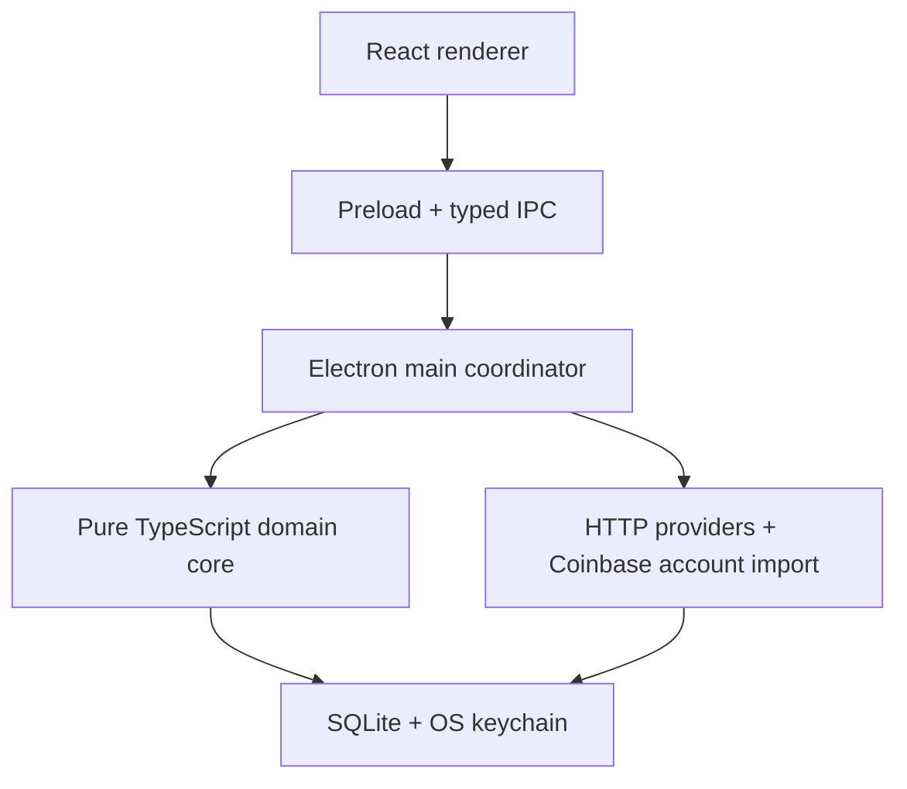
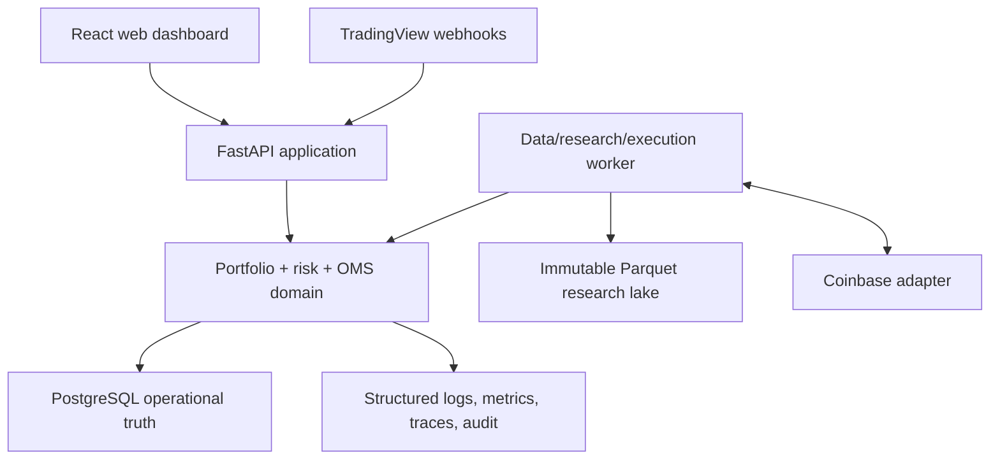
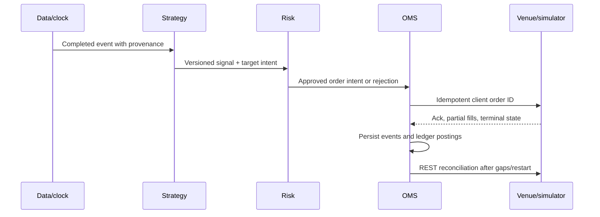

# Coqui Crypto: technical audit and evidence-based rebuild plan

**Audit date:** 2026-08-01  
**Historical baseline:** `kokin-blip/kokin-trading-framework`, branch `pivot/kokintrader`, commit [`80b5a1b`](https://github.com/kokin-blip/kokin-trading-framework/commit/80b5a1bb6f5b655c10f1ca3ebdecd1b3f5a0385d)  
**New repository requested:** `kokin-blip/Coqui-Crypto`  
**Recommendation:** create Coqui Crypto as a clean repository and modular monolith; migrate only verified domain concepts and selected corrected implementations; do not enable live trading.

## Evidence status and scope

This report distinguishes:

- **Verified — pivot:** inspected directly at `80b5a1b`, the requested historical branch.
- **Verified — main:** inspected separately at `b653abc`, ten main-line commits after the pivot merge. These improvements are not attributed to the historical baseline.
- **Reported:** a result recorded in repository history but not independently reproduced from a persisted dataset and run manifest.
- **Assumption / blocked:** not verifiable from the material and repository access available during this audit.

The connected GitHub account could inspect the public historical repository with administrator visibility. The exact `kokin-blip/Coqui-Crypto` repository returned “repository not found,” and public search found no matching repository. It may not exist yet, may have been renamed, may be private without connector access, or may be under another owner. Therefore, the proposed backlog is GitHub-ready but was not written to that repository, and no claims are made about its current contents.

The historical repository was inspected through source, configuration, migrations, tests, scripts, documentation, and commit history. This was a static/design audit, not a security penetration test and not financial, tax, or legal advice.

## 1. Executive summary

KokinTrader is more substantial than its desktop presentation suggests. The historical pivot contains a coherent TypeScript domain core for allocation, trend/momentum, volatility targeting, cost estimation, paper simulation, evidence gates, tax-lot bookkeeping, and several market-data adapters. It also contains unusually explicit safety intent: live execution is compile-time disabled, exchange secrets are stored in the OS keychain, paper and real accounting are separated, and the code repeatedly warns that a backtest is not proof of profit.

The strongest assets are:

1. Pure, testable strategy primitives and risk concepts.
2. A cautious paper-first product philosophy and explicit kill/cost/turnover/position limits.
3. A meaningful body of negative research results, not just promoted winners.
4. Coinbase account import/authentication work and a broad portfolio/tax UX reference.
5. Later main-branch corrections for timestamp preservation, next-bar execution, trial manifests, product-rule-aware paper orders, multi-wallet isolation, IPC contracts, CSP, and renderer sandboxing.

The largest problems in the requested pivot baseline are material:

- Daily signals include the current close and rebalance at that same close. That is an executable-timing leak, despite “look-ahead-free” comments.
- Turnover counts both asset-value changes and the cash change, double-counting ordinary moves between assets and cash.
- Research results are not reproducible: raw snapshots, immutable manifests, code revision, exact dependency/runtime versions, and machine-readable results are not committed together.
- Cost assumptions vary between a 10-basis-point commission shortcut and the application’s 85-basis-point default fee/spread/slippage profile.
- Deflated Sharpe trial counts cover active tracks, not the full parameter and research search history.
- The four-fold walk-forward test switches among already defined tracks; it is not nested parameter-selection validation.
- Paper trading lacks a production order-management and reconciliation model, and tax-import reconciliation can invent zero-basis lots or proportionally resize lots.
- The Electron coordinator and UI are very large and tightly coupled; the pivot main process is about 4,660 lines. On newer `main`, it has grown beyond 9,000 lines despite added contracts and worker abstractions.

The later `main` branch fixes several critical pivot defects. It preserves timestamps and completed-bar quality, moves decisions to the previous completed interval and execution to the next open or a conservative later close, corrects turnover, records a declared trial count, adds deterministic golden fixtures, durable research jobs, paper order/fill state, IPC runtime validation, CSP, and Electron sandboxing. Those changes should be treated as evidence and selectively ported or reimplemented, not as a reason to continue expanding the old shell.

**A new repository is justified.** The reason is not branch aesthetics alone. The desired system has a different boundary: a reproducible research/execution backend with a replaceable UI, rather than a single Electron process coordinating data, tax, research, paper execution, automation, profiles, and presentation. Coqui should begin as a modular monolith with one canonical domain model shared by backtest, paper, and eventual live paths. Avoid microservices until load or failure isolation proves a need.

The first milestone should produce an immutable dataset manifest, normalized timestamped bars/trades, a corrected next-bar backtest, deterministic fixtures, and a benchmark report. It should not include exchange order submission, automated parameter optimization, market making, leverage, derivatives, social-sentiment execution, or multi-exchange live routing.

## 2. Repository and branch findings

### 2.1 Branch state

Four remote branches were verified:

| Branch | Head | Interpretation |
|---|---:|---|
| `pivot/kokintrader` | `80b5a1b` | Requested historical baseline; two commits not on current `main` |
| `main` | `b653abc` | Ten commits beyond the merge base; v0.2.6 and engineering remediation |
| `kokinmemecoin` | `afac319` | Pump.fun/memecoin-era line; keep only as archived history |
| `kokinstocks` | `601bb1b` | Separate stocks experiment; outside Coqui’s initial scope |

The pivot branch has two commits not present on `main`; `main` has ten commits not present on the pivot. This means “latest code” and “requested historical reference” are not the same object. Coqui’s migration process must pin source commits in every migration decision.

### 2.2 Size and verification

| Check | Pivot result | Interpretation |
|---|---:|---|
| TypeScript / TSX | 141 / 35 files | TypeScript-dominant Electron application |
| TS/TSX lines | 36,093 | Medium codebase, but concentrated in large coordinators/components |
| `pnpm typecheck` | Pass | Independently run |
| `pnpm lint` | Pass | Independently run |
| Selected pure strategy/risk/ML tests | 111/111 pass | Independently run |
| Full test run | 434 pass, 15 fail | The 15 failures were four SQLite suites unable to load a `better-sqlite3` native binary in the audit sandbox; this does not establish an application defect |

The newer main worktree contains about 61,896 TypeScript/TSX/Python lines across `src`, `research`, and `tests`. Its committed engineering audit reports 68 files / 578 passing tests before the overhaul. That claim is repository-reported, not independently reproduced here because the audit environment could not install main’s native dependencies.

### 2.3 Current architecture

The pivot is a single-user Electron desktop application:



There is no conventional backend API server, user-authentication service, WebSocket market-data service, real order executor, or TradingView webhook receiver. The application is local-first, uses SQLite, and calls providers from the Electron main process.

### 2.4 Codebase inventory

| Area | Representative files | Purpose and dependencies | Condition | Migration value |
|---|---|---|---|---|
| Application coordinator | [`src/app/main/index.ts`](https://github.com/kokin-blip/kokin-trading-framework/blob/80b5a1bb6f5b655c10f1ca3ebdecd1b3f5a0385d/src/app/main/index.ts) | IPC handlers, DB lifecycle, schedules, provider orchestration, paper runs, exports | Functional but severely over-centralized | Conceptual map only; split into application services |
| Renderer | `src/app/renderer/src` | React dashboard, portfolio, tax, settings, paper wallet, research views | Useful UX reference; several components 900–1,250 lines | Redesign UI; reuse copy/workflows selectively |
| IPC contract | `src/app/ipc-types.ts`, preload | Desktop boundary between renderer and privileged process | Broad and type-heavy; pivot lacks uniform runtime validation | Replace with OpenAPI schemas; main IPC contract is a useful security reference |
| Strategy scoreboard | `src/core/execution/strategy-backtest.ts` | Six tracks, equity/cost metrics, DSR/PSR, walk-forward | Good decomposition, but pivot timing/turnover validity defects | Rewrite around canonical events and next-bar fills |
| Momentum | `momentum.ts` | 120-day absolute/relative momentum, 30-day vol, defensive scaling | Clear, pure, testable; defaults selected from research sweeps | Port logic after independent validation |
| Volatility target | `vol-target.ts` | 40% annualized target, exposure floor/cap, 100-day trend gate | Clear risk overlay; not independent evidence of alpha | Port as a risk-sizing candidate |
| Signal tilt | `signal-tilt.ts`, `market/longterm.ts` | Trend/RSI action plus volatility-regime target tilts | Understandable but heuristic and coupled to product labels | Keep as research hypothesis, not default production strategy |
| Rotation | `rotation.ts` | Top-five, 120-day momentum, absolute filter, inverse-vol, hold buffer | Handles ragged listing histories, but current-universe survivorship remains | Rebuild only after point-in-time universe data exists |
| ML study | `ml-*` | Features, triple barriers, purged/embargoed CV, logistic regression | Sensible small-model research seam; not production ML | Port tests/concepts; require chronological final holdout |
| Cost/risk | `trade-costs.ts`, `guardrails.ts`, `evidence.ts` | Fees/spread/slippage, turnover/cost caps, position/at-risk caps, evidence gate | Strong safety concepts; simplified market realism | Reimplement as first-class policy engine |
| Paper simulation | `paper-wallet.ts`, `paper-account.ts`, `autotrade.ts` | Paper-only allocation and scheduling | Live correctly disabled; pivot lacks durable OMS parity | Replace with the same OMS state machine used by eventual live mode |
| Coinbase public market data | `market/coinbase.ts`, `markets.ts` | REST candles/products/stats; CoinGecko fallback | Useful normalization patterns; no sequence-aware real-time feed | Replace with Advanced Trade REST + WS adapter |
| Coinbase account import | `coinbase-auth.ts`, `coinbase-account.ts` | Ed25519/legacy auth, balances, fills, replay into lots | Valuable auth work; tax reconciliation assumptions are unsafe | Reuse auth tests/concepts; rebuild ledger/reconciliation |
| Other providers | CoinGecko, DefiLlama, alternative.me, news, wallet reads | Market metadata, yields/unlocks, sentiment, awareness | Best-effort product enrichments, not provenance-grade research | Defer; isolate behind typed provider adapters |
| HTTP utilities | `src/core/http` | retries, rate limiting, caching/error normalization | Useful patterns, but provider behavior should be explicit | Rebuild around async Python clients and adapter policies |
| Storage | `src/core/storage`, migrations 1–15 | SQLite WAL, portfolio/tax, daily closes, evidence, paper state | Good local persistence; not an order/ledger/event schema | Fresh Postgres schema; import only user-owned records |
| Secrets | `src/core/secrets`, keytar | OS keychain for exchange/API credentials | Correct local-desktop approach | Use KMS/envelope encryption for hosted mode; keychain only for local mode |
| Packaging | `electron-builder.yml`, release workflow | unsigned/ad-hoc macOS and unsigned Windows family builds | Acceptable family prerelease, not production distribution | Replace with signed web/deployment pipeline or harden desktop later |
| Research script | `scripts/research-deep.mts` | live data fetch, grids, holdout, bootstrap, overlays, negative studies | Intellectually useful; outputs/data not durably reproducible | Preserve study specifications and negative results; replace runner |
| Pump.fun remnants | migrations 1–6, dropped in migration 12; historical branch | tokens/deployers/signals/simulation-era schema | Runtime largely removed but migration archaeology remains | Do not migrate into active schema; archive history only |

### 2.5 Security and reliability audit

#### Pivot findings

- **Positive:** `contextIsolation: true`, `nodeIntegration: false`, narrow preload methods, OS-keychain secret storage, live trading hard-disabled, SQLite WAL and foreign keys, and no exposed credential found in `.env.example`.
- **High:** Electron renderer sandbox is disabled in the pivot.
- **High:** pivot renderer HTML has no Content Security Policy.
- **High:** renderer-supplied external URLs can reach `shell.openExternal` without a strict protocol/host allowlist.
- **High:** IPC safety relies heavily on TypeScript shapes rather than uniform runtime schemas and trusted-sender validation.
- **Medium:** unsigned/notarized artifacts and `hardenedRuntime: false`; safe only as explicitly trusted family/test builds.
- **Medium:** release workflow is manual-only; there is no visible push/PR CI, dependency/SAST/license/SBOM/secret-scan gate, and actions use movable tags rather than commit SHA pinning.
- **Medium:** provider reads are polling-oriented; there is no durable gap detector, replayable raw-event log, dead-letter queue, or end-to-end trace correlation.

Electron’s official checklist recommends process sandboxing, CSP, navigation/window limits, treating `shell.openExternal` input as untrusted, and validating every IPC sender ([Electron security guidance](https://www.electronjs.org/docs/latest/tutorial/security)).

#### Main-only remediation

At [`b653abc`](https://github.com/kokin-blip/kokin-trading-framework/tree/b653abc1922bc2ab3549c5dcfe4a25ab28b6eecc), code inspection verifies `sandbox: true`, a restrictive CSP, denied permission requests, navigation/window interception, runtime Zod IPC contracts, payload limits, response validation, and trusted main-frame/sender checks. Support-release URLs are strictly allowlisted. One generic navigation helper still opens arbitrary `http:` or `https:` destinations; a new system should restrict schemes to HTTPS and preferably use an explicit domain/purpose policy.

These fixes should inform Coqui, but a hosted web UI and backend API make the Electron-specific boundary unnecessary unless a desktop edition remains a firm requirement.

## 3. Strategy and backtest audit

### 3.1 Strategy inventory

| Strategy/system | Intended and actual logic | Data / methodology | Reported evidence | Problems | Decision |
|---|---|---|---|---|---|
| Buy-and-hold | Allocate to user base mix once | Aligned daily closes | Benchmark only | Initial cost and universe are user-mix dependent | Preserve as mandatory benchmark |
| Passive rebalance | Restore base weights every N days | Same daily window and cost model | Benchmark/alternative | Rebalance timing defect in pivot; tax drag not modeled in scoreboard | Rewrite in canonical engine |
| Signal tilt | Trend/RSI long-term action maps to accumulate/hold/trim/exit; volatility regime dampens tilts | Daily close history; heuristic presets | No independently persisted robust evidence | Heuristic thresholds; same-close pivot leak; product action labels can overstate certainty | Keep as candidate, not default |
| Momentum | 120-day absolute and relative risk-adjusted momentum; 30-day vol; negative assets scaled to 20%; relative tilt capped | Daily closes, user base mix | Historical holdout commit reports strong risk-adjusted results | Defaults emerged from repeated sweeps; narrow asset set; pivot timing/cost defects | Rebuild and retest; promising |
| Volatility target | Scale total exposure toward 40% annualized vol; 10–100% exposure; cap at 70% below 100-day trend | Mix daily closes | Stronger drawdown/Sortino reported | Sizing overlay, not alpha; vol estimate and thresholds regime-sensitive | Preserve as risk candidate |
| Trend + vol | Momentum selects assets; vol target sizes exposure | Daily closes | Reported pivot default: mean rolling Sortino 1.70, worst drawdown -24%, full-window +101% | Selected after many trials; raw dataset absent; results use inconsistent cost paths in research script | Highest-priority hypothesis, not proven strategy |
| DCA simulation | Periodic fixed contributions | Historical closes | Planning/education feature | Not an alpha strategy; taxes and execution timing simplified | Preserve later as portfolio workflow |
| Cross-sectional rotation | Top five positive-momentum assets, inverse-vol weights, rank hold buffer | Ragged daily histories | Research-only | Universe is today’s Coinbase list; delisted assets absent; pivot rotation turnover also counts cash | Defer until point-in-time universe exists |
| Fear & Greed overlay | Scale exposure based on alternative.me sentiment | Daily index mapped to exposure | Exploratory | Third-party methodology/provenance and timestamp alignment; easy to data-mine | Research-only, isolated feature flag |
| Meta-label logistic model | Predict whether a long event hits upper/positive barrier; purged/embargoed five-fold evaluation | Close-derived features; 10-day triple barrier; L2 logistic | AUC/precision/uplift study | CV trains on non-overlapping observations both before and after each fold; require final chronological holdout and decision-to-fill simulation | Conceptual reference only initially |
| Volume confirmation | Require volume agreement | Pre-registered research track | **Negative; not adopted** | Coinbase volume history/normalization limits | Preserve negative result, not code path |
| Profit protection | Cut exposure after gains/froth | Pre-registered research track | **Negative; not adopted**; reduced drawdown but harmed return/holdout Sortino | Path-dependent tuning risk | Preserve result only |
| Multi-lookback ensemble | Average multiple momentum horizons | Daily closes | **Negative; not adopted**; rolling Sortino 1.23 vs 1.70 incumbent, DD -28.1% vs -24.1% | Additional complexity without evidence | Do not migrate as active feature |
| Main Simulation Lab / Python DSP | Cost shocks, account sizes, lookahead checks, HAR/regime/noise analysis; offline zero-phase DSP visual analysis | Exported datasets, Python/pandas/scipy | Main-only evidence tooling | Noncausal offline filters (`sosfiltfilt`, centered Savitzky–Golay) are explicitly labeled offline; must never influence deployable signals or promotion | Port manifests/checks, not the broad lab wholesale |

### 3.2 Reported results and their evidentiary weight

Repository history records:

- [`e53e5a0`](https://github.com/kokin-blip/kokin-trading-framework/commit/e53e5a0): calendar alignment/default sweep; reported mean Sortino 1.20 → 1.70, worst drawdown -31% → -24%, full-window return +71% → +101%, DSR 77% → 83%.
- [`6279731`](https://github.com/kokin-blip/kokin-trading-framework/commit/6279731): claimed never-tuned 2016–mid-2021 BTC/ETH/LTC holdout; trend-vol Sortino 2.55 and -27.9% drawdown versus hold -91.4%; momentum Sortino 2.75; reported that trend-vol beat hold/passive Sortino across seven mixes while raw return lagged the bull benchmark and walk-forward selection lagged.
- [`bf484e7`](https://github.com/kokin-blip/kokin-trading-framework/commit/bf484e7): stationary block bootstrap; reported synthetic win rate varied from 48% at 20-day blocks to 68% at 120-day blocks; raw excess-return p=0.29 versus hold; median drawdown -39%, worst -75%.
- [`ffce414`](https://github.com/kokin-blip/kokin-trading-framework/commit/ffce414), [`4e0f293`](https://github.com/kokin-blip/kokin-trading-framework/commit/4e0f293), and [`4f33bb8`](https://github.com/kokin-blip/kokin-trading-framework/commit/4f33bb8): negative volume, profit-protect, and ensemble studies.

These are valuable research notes, especially because negative findings were retained. They are not independently reproducible claims: the commit does not contain the immutable raw input, exact provider responses, run manifest, and result bundle needed to regenerate the figures.

### 3.3 Pivot backtest validity findings

1. **Critical — same-close decision and fill.** In the pivot, `evalSignal(series.slice(0, i + 1))`, momentum, and vol-target see close `i`, while `rebalance()` uses `pricesAt(i)`. A daily close cannot ordinarily be known and filled at that same close. Results need rerunning with a signal timestamp and execution no earlier than the next bar/open/tick.
2. **High — turnover double-count.** Pivot `rebalance()` sums asset-value changes and the cash change. Cash is the settlement remainder, not another traded leg. This conservatively overcharges but distorts strategies with defensive cash and breaks parity with an OMS.
3. **High — inconsistent cost assumptions.** The application default is 60 bps fee + 10 bps spread + 15 bps slippage = 85 bps. Parts of `research-deep.mts` pass `commissionPct: 0.1`, i.e. 10 bps total. Reported comparisons may not share one friction model.
4. **High — understated search correction.** Pivot DSR records five active tracks, while the research script evaluates large configuration grids and successive hypotheses. DSR must include the effective research family, not only displayed finalists. The Deflated Sharpe Ratio exists specifically to account for selection bias and non-normal returns ([Bailey and López de Prado](https://papers.ssrn.com/sol3/papers.cfm?abstract_id=2460551)).
5. **High — walk-forward scope.** The four-fold expanding test selects among fixed finished tracks. It does not nest parameter selection, purge overlapping label horizons, or model research iteration. It answers whether leader-chasing added value, not whether the final default was selected out of sample.
6. **High — universe/survivorship.** The active scoreboard uses assets with positive current base targets and aligns to the shortest recent series. Rotation admits late listings, but the overall universe is still derived from current Coinbase products, excluding delisted failures.
7. **Medium — significance target.** PSR/DSR evaluate a leader’s Sharpe versus zero/search luck; the actual product claim is excess after costs versus hold/passive. Benchmark-relative bootstrap/permutation tests and confidence intervals are also required.
8. **Medium — execution realism.** Flat spread/slippage omits pair liquidity, fee tier, maker/taker order type, bar-range ambiguity, latency, partial fills, increments, min notional, queue position, rejected orders, and market impact.
9. **Medium — regime/sample sufficiency.** A 365-day minimum is not enough on its own. Crypto cycles, venue changes, stablecoin events, liquidity shocks, and changing fee schedules require explicit regime coverage.

The probability of backtest overfitting should be measured over the complete selection procedure, for example with combinatorially symmetric cross-validation/PBO in addition to a truly untouched chronological test ([Bailey et al., PBO](https://papers.ssrn.com/sol3/papers.cfm?abstract_id=2326253)).

### 3.4 Main-only corrections and remaining work

Main’s `strategy-backtest.ts` now passes only `slice(0, i)` to decisions and uses bar `i` open for execution when observed OHLC is present. Its `market-bars.ts` preserves UTC interval identity, source and quality; fallback close-only data is marked and executed conservatively. Turnover now counts executable asset legs only. The research family can supply `trialCount`, and a golden fixture pins timing, cost and dataset output. Main also adds immutable job snapshots, dataset hashes and durable paper order/fill states.

These are the correct direction, but they do not make the reported historical returns production evidence:

- Old findings must be rerun on corrected timing and costs.
- A dataset hash without the durable dataset and source manifest is insufficient.
- Declared trial counts must include all human-guided iterations and feature screens.
- Main’s paper OMS is a useful model, but no live adapter, user-channel reconciliation, cancel/replace behavior, or exchange-failure campaign exists.
- The research Lab’s noncausal visual filters must remain diagnostically isolated.
- A single large coordinator remains a maintainability and fault-isolation risk.

## 4. External research and design implications

### 4.1 Market data

| Need | Recommended initial source | Later/paid option | Design implication |
|---|---|---|---|
| Coinbase spot products, candles, trades, L2 | Coinbase Advanced Trade REST + market WebSocket | Commercial normalized vendor if SLA/history requires | Persist source event time, receive time, sequence, raw hash, normalized version |
| Account/order/fill events | Coinbase authenticated user WebSocket plus REST reconciliation | None initially | WS is an accelerator; REST snapshots remain authority for recovery |
| Broad metadata / research prices | CoinGecko Demo for noncritical enrichment | Paid CoinGecko | Free plan is 100 calls/min and 10k monthly credits; never use as low-latency execution truth ([pricing](https://www.coingecko.com/en/api/pricing)) |
| Network/on-chain aggregates | Coin Metrics Community subset | Coin Metrics paid or another validated vendor | Community data is useful for prototypes but limited and noncommercial ([API](https://docs.coinmetrics.io/api/v4/), [community terms/data](https://gitbook-docs.coinmetrics.io/packages/coin-metrics-community-data)) |
| Tick/order-book/funding/OI/liquidations across venues | Exchange-native APIs for narrow proofs | Tardis or equivalent | Tardis offers normalized tick-level trades/books, derivatives and liquidation datasets; budget only after a strategy needs it ([data details](https://docs.tardis.dev/historical-data-details/overview), [pricing](https://tardis.dev/)) |
| Derivatives | Defer | Binance/Coinbase derivatives adapters, jurisdiction permitting | Funding/OI/liquidations require instrument-specific schemas; see Binance’s official derivatives market-data catalog ([docs](https://developers.binance.com/en/docs/catalog/core-trading-derivatives-trading-usd-s-m-futures/api/rest-api/market-data)) |

Data correctness requirements:

- Use canonical instrument IDs such as `(venue, product_id, product_type)`, never symbol-only joins.
- Store exchange event timestamp, ingestion timestamp, sequence number, provider, schema version, and completeness status.
- On a WebSocket sequence gap, mark the book invalid, resnapshot, and replay if possible; never silently continue.
- Keep raw immutable data in partitioned Parquet and operational state in Postgres. Apache Arrow provides the Parquet interface ([Arrow Parquet](https://arrow.apache.org/docs/python/parquet.html)); DuckDB pushes filters and projections into Parquet scans ([DuckDB](https://duckdb.org/docs/stable/data/parquet/overview)).
- Record point-in-time product/universe membership, delistings, quote currency, fee tier, increments and venue status.
- Separate “research complete bar” from “in-progress UI candle.”

Postgres should be the initial operational database. Add Timescale hypertables only when query/retention volume warrants it; hypertables partition time-series data automatically but are not a substitute for immutable research files ([Timescale hypertables](https://docs.timescale.com/use-timescale/latest/hypertables/)). Redis should be deferred until measured needs for low-latency caching, queues, or distributed locks arise.

### 4.2 Coinbase Advanced Trade

Coinbase Advanced Trade exposes REST for accounts/orders and WebSockets for market and user data ([overview](https://docs.cdp.coinbase.com/coinbase-app/advanced-trade-apis/overview), [REST introduction](https://docs.cdp.coinbase.com/api-reference/advanced-trade-api/rest-api/introduction)). The target adapter must cover:

- scoped CDP API authentication and a read-only connection test;
- product/rules snapshot before order construction;
- order preview, client-generated idempotency ID, create, cancel and status retrieval ([preview](https://docs.cdp.coinbase.com/api-reference/advanced-trade-api/rest-api/orders/preview-orders), [create](https://docs.cdp.coinbase.com/api-reference/advanced-trade-api/rest-api/orders/create-order), [cancel](https://docs.cdp.coinbase.com/api-reference/advanced-trade-api/rest-api/orders/cancel-order));
- market and authenticated user WebSockets, heartbeats, reconnect/backoff and sequence/gap handling;
- startup and periodic REST reconciliation of accounts, open orders, recent orders and fills;
- partial fill, cancel-pending, unknown-submission and terminal-state handling;
- rate-limit budgets isolated by endpoint class and account.

Coinbase documents that many channels close after 60–90 seconds without updates unless heartbeats are subscribed, and its heartbeat channel increments a counter every second ([channels](https://docs.cdp.coinbase.com/coinbase-app/advanced-trade-apis/websocket/websocket-channels)). WebSocket application limits include eight connections and eight unauthenticated messages per second per IP ([limits](https://docs.cdp.coinbase.com/coinbase-app/advanced-trade-apis/websocket/websocket-rate-limits)). Level 2 is the correct order-book feed because it guarantees delivery of updates; quantity is a replacement value, and zero removes a level ([Level 2](https://docs.cdp.coinbase.com/api-reference/advanced-trade-api/websocket/level2)).

Coinbase’s Advanced Trade sandbox returns static predefined responses and does not require authentication. It is useful for contract parsing, not realistic fills, latency, rejection, or matching behavior ([sandbox](https://docs.cdp.coinbase.com/coinbase-app/advanced-trade-apis/sandbox)). Coqui therefore needs its own deterministic exchange simulator and paper environment.

### 4.3 TradingView

Use supported Pine alerts and HTTPS webhooks only. Do not scrape charts, emulate private endpoints, or depend on unofficial session libraries.

TradingView webhooks accept only ports 80/443, cancel requests taking more than three seconds, may occasionally fail, require 2FA, publish source IPs, and explicitly warn against placing credentials in the webhook body ([webhook documentation](https://www.tradingview.com/support/solutions/43000529348-how-to-configure-webhook-alerts/)). Pine alerts can emit valid JSON, but alert instances are snapshots and must be recreated after script/input changes ([alerts](https://www.tradingview.com/pine-script-docs/concepts/alerts/)). TradingView’s broker emulator normally calculates at bar close and fills on the next available tick/open; OHLC path assumptions and Bar Magnifier materially affect backtests ([strategies](https://www.tradingview.com/pine-script-docs/concepts/strategies/), [execution model](https://www.tradingview.com/pine-script-docs/language/execution-model/)).

Webhook design:

1. Receive at an unguessable per-user endpoint over HTTPS.
2. Enforce a small JSON schema and payload size; include `schema_version`, `alert_id`, `strategy_version`, `instrument`, `bar_time`, `issued_at`, `expires_at`, `action`, and parameters.
3. Verify a per-user body secret/signature or shared token without ever using exchange credentials. IP allowlisting is supplemental, not identity.
4. Insert the raw webhook into a durable inbox with a unique idempotency key; acknowledge inside three seconds.
5. Process asynchronously; reject expired, duplicate, unknown-version and out-of-order alerts.
6. Convert the accepted alert into a signal event. Never submit an exchange order in the HTTP request path.
7. Reconcile Pine logic with a versioned backend implementation and run parity fixtures. TradingView is a signal source, not system-of-record strategy state.

### 4.4 Framework comparison

| Framework | Strength | Limitation for Coqui | Recommendation |
|---|---|---|---|
| [NautilusTrader](https://nautilustrader.io/docs/latest/) | Event-driven, Rust core/Python control, one model for backtest and live, Parquet catalog; current Coinbase adapter exists ([adapter](https://nautilustrader.io/docs/latest/integrations/coinbase/)) | Coinbase v2 adapter is Rust-only and must be pinned/proved; framework learning and version coupling | Run a bounded proof of concept; adopt behind an internal port if parity/recovery tests pass |
| [Freqtrade](https://www.freqtrade.io/en/stable/) | Mature crypto strategy/backtest workflow and explicit lookahead analysis ([lookahead tool](https://www.freqtrade.io/en/stable/lookahead-analysis/)) | Bot-centric assumptions and exchange behavior may constrain custom portfolio/OMS domain | Borrow validation patterns; do not make it the product core |
| [Hummingbot](https://hummingbot.org/docs/) | Connector architecture and market-making/execution focus; paper trade mode ([paper](https://hummingbot.org/client/global-configs/paper-trade/)) | Complexity and market-making orientation exceed phase-one needs | Reference connector/OMS behavior; defer market making |
| [vectorbt](https://vectorbt.dev/) | Very fast vectorized hypothesis scans and parameter surfaces | Vectorized fill semantics can hide event/order behavior | Optional research tool, never the execution source of truth |
| [CCXT](https://docs.ccxt.com/) | Broad unified REST API across many exchanges | Unified API cannot erase venue-specific order/rate/auth semantics; WS/support varies | Useful for read-only research breadth or prototypes; production adapters remain venue-specific |
| Custom event engine | Exact domain fit and complete control | High cost and risk of reinventing matching/accounting details | Keep a narrow internal domain and use a maintained engine where it proves compatible |

Recommended approach: define Coqui-owned domain ports first. Prove NautilusTrader with Coinbase historical replay, next-bar strategy parity, paper order lifecycle, and restart recovery. If it passes, use it as an internal engine. If not, retain the domain and implement the smallest required event loop. Do not couple UI/API schemas directly to any framework’s classes.

### 4.5 Strategy evidence hierarchy

**Academically/empirically supported as a broad effect, still requiring crypto-specific validation:** time-series trend/momentum. The canonical multi-asset study found persistence across liquid futures ([Moskowitz, Ooi, Pedersen](https://www.sciencedirect.com/science/article/pii/S0304405X11002613)). Crypto-specific evidence is mixed, which is exactly why Coqui must not infer profitability from the general anomaly: one study reports momentum effects ([Han, 2023](https://papers.ssrn.com/sol3/papers.cfm?abstract_id=4675565)), while another finds no strong evidence ([Grobys and Sapkota](https://osuva.uwasa.fi/bitstreams/ffee5cb1-92a8-443e-a117-cbaacd8a1028/download)); newer work emphasizes severe momentum crashes and tail dependence ([2025 study](https://link.springer.com/article/10.1007/s11408-025-00474-9)).

**Promising primarily as risk/portfolio controls:** volatility scaling, trend gates, conservative rebalancing, diversification, cash exposure, and explicit drawdown/position limits. Evaluate both return and tail-risk consequences.

**Potentially viable but data/execution intensive:** mean reversion, breakout, funding/basis, cross-venue arbitrage, statistical arbitrage and market making. These require tick/order-book data, realistic queue/fill/latency models, inventory/borrow/funding controls, venue capital and operational resilience. They are inappropriate before the data and OMS foundation.

**Product/workflow rather than alpha:** DCA, tax-aware rebalancing, alerts, portfolio monitoring.

**Weak without unusually strong evidence:** generic grid bots, social/sentiment triggers, opaque AI predictions, indicator stacking, and copied TradingView strategies. Treat them as preregistered hypotheses with a complete trial ledger.

## 5. Gap analysis

| Category | Findings |
|---|---|
| Existing strengths | Pure strategy/risk functions; negative research history; paper-first/live-off boundary; OS keychain; cost/turnover/position gates; Coinbase auth/import; tests; user-oriented portfolio and tax workflows; main-only next-bar and data-manifest fixes |
| Missing capabilities | Immutable raw research data; point-in-time universe; event/tick/L2 ingestion; canonical instrument registry; OMS; user WS reconciliation; double-entry position/cash ledger; idempotent order submission; startup recovery; hosted identity/authorization; webhook inbox; provenance; SLOs/metrics/traces; automated PR CI/security gates |
| Weak implementations | Pivot timing and turnover; flat cost model; DSR trial accounting; non-nested walk-forward; tax reconciliation assumptions; polling data; paper/backtest semantic drift; provider-specific identity; unsigned distribution |
| Unnecessary complexity | Historical Pump.fun migrations, dormant branches, broad news/yield/watchlist/advisor features in the core coordinator, large IPC/UI surface, premature adaptive “crew/controller” concepts on main |
| Security concerns | Pivot Electron sandbox/CSP/IPC/external-link weaknesses; release signing; future hosted secret isolation; webhook forgery/replay; dependency/action pinning; least-privilege exchange keys |
| Reliability concerns | Silent/partial history import in pivot; no sequence-aware feeds; no raw replay log; no durable dead-letter/retry policy; no authoritative reconciliation loop; native desktop DB/profile lifecycle complexity |
| High-value opportunities | Reproducible research bundles; identical strategy/order semantics in backtest/paper/live; portfolio-aware risk; transparent evidence ledger; TradingView as secured signal input; excellent recovery/reconciliation UX; strategy comparison that exposes uncertainty and capacity rather than promising profit |

### Tax/accounting warning

Pivot fill replay creates zero-cost lots for unexplained positive balances and proportionally scales lots when live balances are lower. That may help reconcile a UI total, but it does not establish tax basis or specific-lot identity. IRS guidance says digital-asset basis includes acquisition costs and requires accurate basis records ([Form 8949 instructions](https://www.irs.gov/instructions/i8949)); broker Form 1099-DA gross-proceeds reporting began for 2025 transactions and certain basis reporting begins for 2026 acquisitions/transactions ([IRS digital assets](https://www.irs.gov/filing/digital-assets), [2024 final-regulation bulletin](https://www.irs.gov/irb/2024-31_irb)).

Coqui must represent deposits, withdrawals, rewards, conversions, adjustments and unresolved reconciliation exceptions explicitly. Tax exports must be labeled estimates until every lot is sourced or user-resolved, and reviewed by a qualified tax professional for the user’s jurisdiction.

## 6. Proposed system architecture

### 6.1 Architectural style

Start with a **modular monolith plus workers**, deployed as two runtime processes from one repository:

- `api`: FastAPI application, identity, commands/queries, webhook ingestion, portfolio/risk/OMS coordination.
- `worker`: data ingestion, research runs, paper sessions, reconciliation and notifications.

Both use the same Python packages and Postgres schema. The React frontend is a separately built client. This is not a microservice architecture: modules communicate through typed in-process interfaces and durable Postgres records. Add a message broker or service split only after measured contention, independent scaling, or failure isolation demands it.

### 6.2 Component diagram



### 6.3 Canonical decision-to-reconciliation flow



The same `Strategy`, `RiskPolicy`, `OrderIntent`, `OrderEvent`, `Fill`, `LedgerPosting`, and clock abstractions must operate under historical replay, deterministic paper simulation, and live adapter modes. Environment-specific code is restricted to market clock/data and venue execution ports.

### 6.4 Technology decisions

| Concern | Choice | Rationale |
|---|---|---|
| Quant/domain/backend | Python 3.12+, FastAPI, Pydantic, SQLAlchemy, Alembic | Strong quantitative ecosystem; one language for research and operational domain; typed schemas and migrations |
| Trading engine | Coqui domain ports with a NautilusTrader proof of concept | Gains event-driven parity/Rust performance if compatible without surrendering domain ownership |
| Frontend | TypeScript, React, Vite, TanStack Query/Router, generated OpenAPI client | New UX, type-safe boundary, simpler than requiring Next.js server features initially |
| Operational DB | PostgreSQL | Transactions, constraints, JSON metadata, advisory locks, mature recovery; source of truth for orders/ledger/users/runs |
| Time series | Normal Postgres tables first; Timescale only after benchmarks | Avoid premature extension dependency |
| Research data | Partitioned Parquet + Arrow; DuckDB/Polars for local queries | Immutable, portable, efficient columnar replay and notebooks |
| Queue | Postgres job/outbox tables initially | Durable and simple; add Redis/NATS only with measured throughput/latency need |
| Decimal money | Decimal/fixed-point types, never binary float for orders/ledger | Reproducible rounding and venue increment compliance |
| Containers | Docker Compose for dev; OCI images for deployment | Reproducible local/CI environments |
| Observability | Structured JSON logs, Prometheus-compatible metrics, OpenTelemetry traces | Correlate signal → risk → order → fill → reconciliation; OTel is vendor-neutral ([docs](https://opentelemetry.io/docs/)) |
| Security | OIDC session identity, RBAC, CSRF protection, KMS/envelope-encrypted secrets, audit log | Backend-only exchange credentials and least privilege |
| Rust/Go | No authored service initially | Rust arrives transitively if Nautilus is adopted; no proven need for another operational language |

### 6.5 Domain/module boundaries

- **instruments:** venue products, canonical assets, increments, statuses, point-in-time universe.
- **market_data:** raw envelopes, normalized trades/bars/books, completeness and gap state.
- **research:** dataset snapshots, manifests, hypothesis/trial registry, runs, metrics, artifacts.
- **strategies:** pure versioned decisions; no network, DB, wall clock, or exchange SDK imports.
- **backtest:** clock/replay, cost/fill models, benchmark and statistical evaluation.
- **portfolio:** accounts, balances, lots, positions, targets and valuation.
- **risk:** pre-trade limits, drawdown/volatility/capacity state, kill switches and approvals.
- **oms:** orders, transitions, idempotency, cancel/replace, fills, reconciliation.
- **venues:** Coinbase implementation behind narrow ports; future adapters remain venue-specific.
- **webhooks:** TradingView authentication, inbox, dedupe, expiry and asynchronous dispatch.
- **identity/secrets:** users, workspaces, roles, credential references and rotations.
- **notifications:** durable outbox and channel adapters.
- **audit/observability:** append-only decisions and correlated telemetry.

### 6.6 Core schemas

Operational Postgres entities should include:

- `users`, `workspaces`, `memberships`, `exchange_credentials` (encrypted reference only);
- `venues`, `instruments`, `instrument_rule_versions`, `universe_memberships`;
- `strategies`, `strategy_versions`, `hypotheses`, `trial_registry`, `dataset_snapshots`, `research_runs`, `research_metrics`, `artifacts`;
- `accounts`, `balance_snapshots`, `positions`, `lots`, `transfers`, `rewards`, `adjustments`;
- `signals`, `risk_decisions`, `order_intents`, `orders`, `order_events`, `fills`, `ledger_entries`, `reconciliation_runs`, `reconciliation_exceptions`;
- `webhook_inbox`, `jobs`, `outbox`, `audit_events`, `kill_switches`.

Every order-state mutation and ledger posting occurs in one DB transaction. External submission uses a durable intent and stable client order ID; ambiguous timeouts transition to `unknown`, never blind retry. Recovery queries the venue before deciding to resubmit.

### 6.7 Deployment and security boundary

Initial deployment can be one private environment with managed Postgres, one API container, one worker container, object storage and the static web app. Keep execution off by configuration and compile/deployment policy. Separate read-only research credentials from future trade credentials. Deny transfer/withdrawal permission. Use distinct keys per environment/account, secret rotation, encrypted backups, audit retention and IP/network restrictions where supported.

Before distributing to other users or acting on their assets, obtain jurisdiction-specific counsel. FinCEN’s guidance distinguishes users, exchangers and administrators and analyzes when convertible-virtual-currency business models may be money transmission ([FIN-2019-G001](https://www.fincen.gov/system/files/2019-05/FinCEN%20Guidance%20CVC%20FINAL%20508.pdf)). The architecture should avoid custody and transfer authority by design, but software design alone does not determine regulatory status.

## 7. Proposed repository structure

```text
Coqui-Crypto/
├── README.md                    # Scope, safety status, quick start
├── CONTRIBUTING.md              # Workflow, review and evidence rules
├── SECURITY.md                  # Disclosure and secret-handling policy
├── pyproject.toml               # Locked Python workspace/tooling
├── pnpm-workspace.yaml          # Frontend workspace
├── compose.yaml                 # Local Postgres/API/worker
├── .github/
│   ├── workflows/               # PR, security, image and release gates
│   ├── ISSUE_TEMPLATE/          # Backlog templates
│   └── CODEOWNERS
├── apps/
│   ├── api/                     # FastAPI composition root and HTTP schemas
│   ├── worker/                  # Jobs, ingestion, paper/reconciliation loops
│   └── web/                     # React/Vite dashboard
├── packages/
│   ├── domain/                  # Money, instruments, signals, orders, ledger
│   ├── market_data/             # Normalization, quality, gaps, bars/books
│   ├── strategies/              # Pure versioned strategy implementations
│   ├── backtest/                # Replay, fills, costs, metrics, validation
│   ├── portfolio/               # Accounts, lots, positions, targets
│   ├── risk/                    # Policies, limits, approvals, kill switches
│   ├── oms/                     # Order state machine and reconciliation
│   ├── venues_coinbase/         # Advanced Trade REST/WS adapter
│   ├── webhooks_tradingview/     # Secure inbox and signal translation
│   ├── persistence/             # SQLAlchemy repositories and Alembic
│   └── observability/           # Logging, metrics, tracing and audit helpers
├── research/
│   ├── hypotheses/              # Preregistered machine-readable specs
│   ├── notebooks/               # Exploration only; imports production libs
│   ├── datasets/                # Manifests/pointers, not untracked blobs
│   └── reports/                 # Generated summaries and negative results
├── schemas/                     # Versioned external/event JSON schemas
├── migrations/                  # Fresh Postgres baseline and forward changes
├── tests/
│   ├── unit/
│   ├── property/
│   ├── contract/
│   ├── integration/
│   ├── replay/
│   ├── failure/
│   └── fixtures/
├── scripts/                     # Thin repeatable developer/CI commands
├── docs/
│   ├── architecture/            # ADRs and diagrams
│   ├── research/                # Evidence policy and trial ledger docs
│   ├── operations/              # Runbooks, recovery, key rotation
│   └── migration/               # Source commit → destination decisions
└── infra/                        # Container/deployment definitions, no secrets
```

Notebooks may call `packages/strategies` and `packages/backtest`; production code must never import a notebook. Generated OpenAPI TypeScript types are committed or reproducibly generated. Package dependencies point inward toward `domain`, with composition only in `apps`.

## 8. Migration matrix

| Existing component | Source | Quality / dependency | Decision | Destination / required change | Priority |
|---|---|---|---|---|---:|
| Domain types and pure allocation math | `src/core/types`, allocation/rebalance modules | Generally clear; TS-specific types | Rewrite/port with golden tests | `packages/domain`, `portfolio`; Decimal/fixed-point and explicit clocks | P0 |
| Backtest tracks | `strategy-backtest.ts` | Good shape; pivot invalid timing/turnover | Rewrite, using main fixes as reference | `packages/backtest`; canonical events, next-bar fills, point-in-time universe | P0 |
| Main market-bar normalization | main `market-bars.ts` | Strong correction; tied to old shapes | Refactor/port | `market_data`; provenance, sequences, quality flags, raw pointers | P0 |
| Trade cost model | `trade-costs.ts`, main `realism.ts` | Useful conservative baseline, still flat | Refactor | Versioned fee tiers, spread, slippage, impact/capacity scenarios | P0 |
| Risk guardrails | guard/evidence/risk files | Strong concepts | Refactor/port tests | `risk`; policy objects and persisted state | P0 |
| Live-disabled boundary | `autotrade.ts` | Correct safety intent | Preserve behavior | Deployment policy + disabled adapter feature; no trade scope initially | P0 |
| Momentum | `momentum.ts` | Pure/promising, defaults data-mined | Port as candidate | `strategies/trend_momentum`; new preregistration and corrected rerun | P1 |
| Vol target | `vol-target.ts` | Pure risk overlay | Port as candidate | `strategies/vol_target`; separate alpha and sizing attribution | P1 |
| Trend-vol | strategy composition | Best historical candidate, unproven | Reimplement | Versioned composition with full trial/evidence record | P1 |
| Signal tilt | `signal-tilt.ts`, `longterm.ts` | Heuristic/product-coupled | Conceptual reference | Research candidate only after benchmarks | P2 |
| Walk-forward/significance | `walk-forward.ts`, `significance.ts` | Useful but insufficient scope | Replace/extend | Nested chronological validation, CSCV/PBO, benchmark-relative uncertainty | P1 |
| ML primitives/meta-label | `ml-*` | Good educational implementation | Retain tests/specification; use maintained libraries | sklearn/statsmodels or explicit small model; final chronological holdout | P3 |
| Rotation | `rotation.ts` | Ragged history support; survivorship gap | Defer/rewrite | Only after universe membership/delisting data | P3 |
| Research deep script | `scripts/research-deep.mts` | Valuable study record; nonreproducible runner | Preserve as documentation, replace | Hypothesis specs, immutable snapshots, run manifests and artifact bundles | P0 |
| Main multi-cycle/Simulation Lab | main execution/research files | Many valuable checks; growing complexity | Selective port | Dataset/trial/golden/lookahead checks first; defer adaptive controllers | P1 |
| Main Python DSP report | `research/python` | Evidence-only; contains noncausal offline filters | Retain visual ideas only | Diagnostics package with explicit causal/noncausal types | P3 |
| Coinbase authentication | `coinbase-auth.ts` | Useful Ed25519/legacy tests | Reimplement with official SDK or audited signer | `venues_coinbase/auth`; read-only first, least privilege | P1 |
| Coinbase market/account reads | `market/coinbase*.ts` | Useful parsing; polling/legacy endpoint mix | Rewrite | Advanced Trade REST/WS, pagination completeness, raw envelopes | P1 |
| Fill-to-tax replay | `coinbase-account.ts` | Unsafe reconciliation assumptions | Do not port implementation | Explicit transfer/reward/adjustment ledger and exception workflow | P2 |
| Main paper OMS v3 | main `paper-orders.ts`, migrations | Strong state vocabulary and decimal direction | Refactor/port behavior | `oms` + simulator; one state machine for paper/live | P1 |
| SQLite schema/migrations | `storage/migrations.ts` | Historical/Pump.fun baggage | Do not copy | Fresh Postgres schema; separate one-time user-data importer | P0 |
| Keytar secrets | `secrets` | Good desktop pattern | Replace for hosted; optional local edition | KMS/envelope encryption, credential references and rotation | P1 |
| HTTP/rate limiter | `core/http` | Useful patterns | Reimplement per adapter | Async clients, endpoint budgets, retry taxonomy, circuit state | P1 |
| React renderer | `app/renderer` | Product reference, oversized components | Redesign from scratch | `apps/web`; API-driven, accessible component system | P2 |
| Electron main/preload/IPC | `app/main`, preload, ipc types | Tight coupling; main fixes security but coordinator grows | Abandon as primary architecture | FastAPI/OpenAPI/application services; optional desktop wrapper later | P0 |
| Tax/portfolio workflows | portfolio/tax UI/core | Useful user value, needs authoritative records | Refactor concepts | `portfolio` and new UX; mark estimates/exceptions | P2 |
| News/yields/watchlists/advisor | various | Noncore enrichment and coordinator load | Defer | Separate adapters after core reliability | P4 |
| Pump.fun tables/code/branch | migrations 1–6, `kokinmemecoin` | Obsolete for stated product | Archive only | Migration documentation; no runtime destination | P4 |
| Release packaging | Electron builder/workflow | Unsigned family build | Replace | PR CI, signed container provenance, managed web deploy | P1 |

## 9. Phased development roadmap

Each phase leaves the repository runnable and demonstrable.

### Phase 0 — Foundation and safety contract

- **Goal:** a clean, enforceable project boundary.
- **Tasks:** repository standards, ADR template, dependency locks, Python/TS lint/type/test, Docker Compose, Postgres, CI, secret scanning, SBOM/dependency review, threat model, explicit `LIVE_TRADING_AVAILABLE=false` policy.
- **Dependencies:** new repository access.
- **Output:** API health endpoint, worker heartbeat, web shell, migration baseline.
- **Tests:** clean-clone bootstrap, migration up/down-in-test, CI matrix, no-secret fixture.
- **Done:** one command starts the stack; every PR is gated; no exchange credential or order path exists.

### Phase 1 — Market data and reproducible datasets

- **Goal:** trustworthy historical inputs before strategies.
- **Tasks:** instrument/rule registry; Coinbase read-only REST; completed daily bars; raw envelope; Parquet partitions; manifest with hashes, source ranges, gaps, code revision and schema version; point-in-time product snapshots.
- **Dependencies:** phase 0.
- **Output:** deterministic BTC/ETH/LTC fixture and versioned research snapshot.
- **Tests:** contract fixtures, timestamp boundaries, duplicates, gaps, late/out-of-order events, hash reproducibility.
- **Done:** a second machine recreates the exact dataset hash and quality report.

### Phase 2 — Canonical backtest and evidence engine

- **Goal:** a defensible benchmark harness.
- **Tasks:** event clock; previous-completed-bar decision; next-open/next-tick fill; Decimal rules; hold/passive benchmarks; fee/spread/slippage scenarios; metrics; trial registry; nested chronological holdout; block bootstrap; PBO/DSR; artifact bundle.
- **Dependencies:** phase 1.
- **Output:** golden benchmark report and machine-readable run bundle.
- **Tests:** future-data perturbation, next-bar timing, rounding, cost accounting, deterministic replay, pathological bars, delisting/universe fixtures.
- **Done:** pivot defect fixtures fail under old semantics and pass under new; full run is reproducible.

### Phase 3 — Strategy migration

- **Goal:** evaluate, not assume, the strongest historical hypotheses.
- **Tasks:** port passive, momentum, vol-target and trend-vol; preregister ranges before viewing final holdout; rerun historical and main-reported studies with one cost model; preserve negative results.
- **Dependencies:** phase 2.
- **Output:** promote/reject reports for each candidate.
- **Tests:** implementation parity, parameter sensitivity surfaces, multiple-cost and regime stress, benchmark-relative confidence.
- **Done:** every default points to a hypothesis, trial count, immutable dataset and untouched result; no UI claim says “profitable.”

### Phase 4 — OMS and deterministic paper simulator

- **Goal:** one production-grade order lifecycle without venue submission.
- **Tasks:** intent/order/event/fill/ledger schemas; idempotency; product-rule rounding; partial/rejected/expired fills; cancel/replace; market/limit simulation; startup recovery; reconciliation exceptions; persisted risk state.
- **Dependencies:** phases 1–3.
- **Output:** paper account whose ledger exactly rebuilds from events.
- **Tests:** state-machine property tests, crash at every transition, duplicate event/submission, partial fills, stale prices, insufficient balance, ledger invariants.
- **Done:** restart and replay reproduce balances/orders byte-for-byte; paper and backtest share strategy/risk/intent semantics.

### Phase 5 — Coinbase read-only and shadow integration

- **Goal:** validate real account/data behavior without orders.
- **Tasks:** Advanced Trade auth, permission probe, account/fill pagination, market/user WS, heartbeats, reconnect, gap resnapshot, shadow order preview, REST reconciliation.
- **Dependencies:** phase 4.
- **Output:** read-only account mirror and shadow OMS comparison.
- **Tests:** recorded contract fixtures, cursor loops/caps, WS disconnect/sequence gaps, revoked key, rate limits, clock skew, unknown products.
- **Done:** 30+ days of account/data shadow operation with zero unexplained state and documented SLOs.

### Phase 6 — TradingView secured ingestion

- **Goal:** safely accept external signals without direct execution.
- **Tasks:** schema, secret/signature, unguessable route, inbox/dedupe/expiry, asynchronous dispatch, Pine/backend parity fixture, delivery dashboards.
- **Dependencies:** phases 0, 4.
- **Output:** signal appears in paper strategy timeline exactly once.
- **Tests:** replay, duplicate, stale, malformed, oversized, wrong secret, out-of-order, three-second acknowledgement, delayed worker.
- **Done:** failure campaign demonstrates no duplicate order intent.

### Phase 7 — Portfolio, tax-aware records and new UI

- **Goal:** usable research/paper product with transparent data quality.
- **Tasks:** positions/lots/transfers/rewards/adjustments; exception resolution; dashboards for datasets, runs, signals, risk, orders, fills and reconciliation; accessible responsive design; export.
- **Dependencies:** phases 1–6.
- **Output:** end-to-end research-to-paper UX.
- **Tests:** role/authz, accessibility, browser E2E, export round-trip, tax exception labeling.
- **Done:** a user can explain every displayed balance and every paper decision from source events.

### Phase 8 — Observability, operations and recovery

- **Goal:** prove the system can fail safely.
- **Tasks:** correlated IDs, metrics/traces/logs, SLOs, alerts, runbooks, encrypted backups/restores, chaos/failure drills, key rotation, retention, incident review template.
- **Dependencies:** all operational phases.
- **Output:** recovery evidence pack.
- **Tests:** exchange outage, DB failover, worker crash, delayed feed, duplicate WS, corrupted cache, restore drill.
- **Done:** recovery objectives are met and alerts identify unsafe/stale state before a decision proceeds.

### Phase 9 — Live-trading readiness review, not automatic launch

- **Goal:** decide whether a narrow live pilot is justified.
- **Tasks:** independent code/security review; legal/tax review; corrected out-of-sample evidence; at least 90 distinct paper days plus adequate decisions/fills across regimes; preview/create/cancel proof; scoped key; hard notional caps; human two-step arming; kill/reconciliation drills.
- **Dependencies:** phases 0–8 and stable operations.
- **Output:** signed go/no-go dossier.
- **Tests:** production-like failure campaign and tiny-notional dry run only after approval.
- **Done:** explicit human go decision. A “no” is a valid completion outcome.

### Deferred phases

Additional exchanges, derivatives, funding/basis, tick-level market making, ML promotion, mobile/desktop wrappers, social sentiment and multi-tenant commercial operation each require separate evidence, threat and regulatory reviews. None belongs in the foundation milestone.

## 10. Initial GitHub backlog

### 10.1 Milestones and labels

Milestones: `M0 Foundation`, `M1 Data`, `M2 Backtest`, `M3 Strategies`, `M4 Paper OMS`, `M5 Integrations`, `M6 Product`, `M7 Operations`, `M8 Live Readiness`.

Core labels:

- Type: `type:architecture`, `type:feature`, `type:bug`, `type:research`, `type:security`, `type:ops`, `type:docs`.
- Area: `area:data`, `area:backtest`, `area:strategy`, `area:risk`, `area:oms`, `area:coinbase`, `area:tradingview`, `area:web`, `area:portfolio`, `area:infra`.
- Priority: `P0`, `P1`, `P2`, `P3`.
- Safety/evidence: `live-blocker`, `data-quality`, `reproducibility`, `needs-ADR`, `needs-threat-model`.

### 10.2 Ready-to-create issues

| ID | Milestone / labels | Title and acceptance-oriented description | Depends on |
|---:|---|---|---|
| 1 | M0 · P0 · architecture | **Record the Coqui safety and scope ADR.** Define paper-first scope, modular-monolith boundary, prohibited live/withdrawal capabilities, and evidence vocabulary. Done when reviewed and linked from README. | — |
| 2 | M0 · P0 · infra | **Bootstrap Python/TypeScript workspace and reproducible local stack.** Add locked dependencies, API/worker/web shells, Postgres Compose and one-command bootstrap. | 1 |
| 3 | M0 · P0 · security | **Create CI and software-supply-chain gates.** Type, lint, unit/integration, migration, secret, dependency/license/SBOM and container scans; pin actions by SHA. | 2 |
| 4 | M0 · P0 · security | **Threat-model credentials, webhooks and eventual order submission.** Document assets, trust boundaries, abuse cases and required controls. | 1 |
| 5 | M1 · P0 · data | **Define canonical instrument and market-event schemas.** Include venue/product IDs, timestamps, sequence, source, quality and schema version. | 1,2 |
| 6 | M1 · P0 · coinbase | **Implement read-only Coinbase product/rule adapter.** Persist point-in-time increments, limits and status; no account/order scope. | 5 |
| 7 | M1 · P0 · data | **Persist immutable raw and normalized daily bars.** Partition Parquet and generate checksums/completeness reports. | 5,6 |
| 8 | M1 · P0 · reproducibility | **Create dataset manifest and replay command.** Capture source ranges, hashes, gaps, schema/runtime/code revision; reproduce on a clean machine. | 7 |
| 9 | M1 · P1 · data-quality | **Build data-gap and duplicate failure fixtures.** Cover incomplete UTC bars, out-of-order rows, duplicates, missing intervals and symbol collisions. | 7 |
| 10 | M2 · P0 · backtest | **Implement canonical replay clock and next-bar execution.** Decisions see only completed prior data; fills occur no earlier than next eligible event. | 8 |
| 11 | M2 · P0 · backtest | **Implement fixed-point portfolio, fills and cost ledger.** Separate asset turnover from cash remainder and enforce venue increments. | 10 |
| 12 | M2 · P0 · research | **Implement run manifest, hypothesis and trial registry.** Every run stores all attempted configurations, seed, costs, dataset and artifacts. | 8,10 |
| 13 | M2 · P1 · research | **Add nested chronological validation, bootstrap, DSR and PBO reports.** Compare excess after costs versus hold/passive, not Sharpe versus zero alone. | 11,12 |
| 14 | M2 · P0 · backtest | **Add pivot-regression golden fixtures.** Demonstrate same-close and cash-turnover defects and pin corrected outputs. | 10,11 |
| 15 | M3 · P1 · strategy | **Port hold and passive benchmarks.** Establish attribution and tax/cost-aware reference behavior. | 11–14 |
| 16 | M3 · P1 · research | **Preregister and port momentum candidate.** Freeze ranges before final holdout and link source commit/specification. | 12–15 |
| 17 | M3 · P1 · research | **Preregister and port volatility-target overlay.** Attribute exposure sizing separately from asset selection. | 12–15 |
| 18 | M3 · P1 · research | **Evaluate composed trend-vol candidate on corrected data.** Rerun claimed windows/cost shocks and publish promote/reject result. | 16,17 |
| 19 | M3 · P1 · docs | **Import historical negative-result register.** Record volume, profit-protect and ensemble tests without activating code paths. | 12 |
| 20 | M4 · P0 · oms | **Define order state machine and invariants.** Include proposed, risk-rejected, submission-pending, unknown, partial, cancel and reconciled states. | 1,11 |
| 21 | M4 · P0 · risk | **Implement persisted pre-trade risk policy.** Notional, turnover, cost, position, concentration, drawdown, stale-data and kill-switch checks. | 20 |
| 22 | M4 · P0 · oms | **Build deterministic exchange simulator.** Market/limit, increments, fees, slippage, partial/rejected/expired fills and seeded latency. | 20,21 |
| 23 | M4 · P0 · oms | **Implement append-only ledger and event replay.** Prove balances/positions rebuild exactly after restart. | 20,22 |
| 24 | M4 · P0 · failure | **Run crash/idempotency/reconciliation property tests.** Interrupt every transition and inject duplicate/late events. | 22,23 |
| 25 | M5 · P1 · coinbase | **Implement least-privilege Advanced Trade authentication probe.** Reject transfer/withdrawal scope and store only encrypted credential references. | 4,6 |
| 26 | M5 · P1 · coinbase | **Implement market and user WebSocket supervisors.** Heartbeats, sequence gaps, reconnect, rate budgets and stale-state blocks. | 6,21 |
| 27 | M5 · P0 · coinbase | **Implement read-only account/fill reconciliation.** Complete pagination, fail atomically, surface unresolved transfers/rewards/adjustments. | 25,26 |
| 28 | M5 · P0 · live-blocker | **Implement shadow order preview and unknown-submission recovery.** No create-order call; compare intents to Coinbase preview/rules. | 24–27 |
| 29 | M5 · P1 · tradingview | **Build authenticated TradingView webhook inbox.** Fast ACK, schema, secret, dedupe, expiry and async processing. | 4,20 |
| 30 | M5 · P1 · tradingview | **Add Pine/backend signal parity fixtures.** Pin strategy version, bar timing and next-tick semantics. | 29,16–18 |
| 31 | M6 · P1 · portfolio | **Model lots, transfers, rewards and reconciliation exceptions.** Never synthesize authoritative zero basis; label unresolved tax output. | 23,27 |
| 32 | M6 · P1 · web | **Build research and dataset evidence dashboard.** Expose manifest, gaps, trials, metrics, uncertainty and artifacts. | 8,13 |
| 33 | M6 · P1 · web | **Build paper order/risk/reconciliation dashboard.** Every decision links to inputs, policy, order events, fills and ledger. | 21–24 |
| 34 | M7 · P0 · ops | **Instrument end-to-end correlation and SLOs.** Trace dataset/signal/risk/order/fill/reconcile IDs; alert on stale or divergent state. | 23,26 |
| 35 | M7 · P0 · ops | **Write and execute backup, restore, outage and key-rotation runbooks.** Attach drill evidence and measured recovery times. | 27,34 |
| 36 | M8 · P0 · live-blocker | **Assemble live-readiness go/no-go dossier.** Independent reviews, OOS/paper evidence, failure drills, legal scope, caps and human arming. This issue cannot auto-close from metrics. | all prior safety-critical issues |

### 10.3 Definition of done

Every issue must include tests, documentation and observability appropriate to its change; pass clean-clone CI; contain no secret; update schemas/migrations atomically; preserve backward-compatible external contracts or version them; and link the relevant ADR/threat model. Research issues additionally require hypothesis registration before final evaluation, immutable dataset/run manifests, all attempted trials, costs, benchmarks, negative results and a machine-readable artifact. OMS/risk issues require failure-path and restart tests, not only happy paths.

## 11. Risk register

| Risk | Probability | Impact | Mitigation | Detection |
|---|---|---|---|---|
| Financial loss from erroneous order | Medium once live exists | Critical | Live absent by default; least-privilege keys, hard notional caps, two-step arming, pre-trade risk, preview, kill switch | Order/risk audit, cap alerts, reconciliation |
| Same-bar/look-ahead/data leakage | High without controls | Critical | Canonical clock, next-event execution, future-perturbation tests, chronological holdout | Lookahead CI suite, code review, parity fixtures |
| Overfitting/researcher degrees of freedom | High | High | Preregister hypotheses/ranges, complete trial registry, PBO/DSR, untouched holdout, negative-result retention | Trial-count reconciliation, OOS decay monitoring |
| Incorrect/gapped market data | Medium | Critical | Raw envelopes, sequence/completeness state, resnapshot, multi-source spot checks, stale-data risk block | Gap metrics, dataset quality report, checksum divergence |
| Survivorship/universe bias | High in current-universe studies | High | Point-in-time products, delistings, listing eligibility, fixed research universe manifests | Universe audit and coverage report |
| Unrealistic fees/slippage/impact | High | High | Venue/fee-tier versions, spread/liquidity snapshots, cost shocks, capacity limits, paper-vs-model calibration | Realized execution shortfall and model residual dashboards |
| Duplicate orders | Medium | Critical | Stable client order IDs, durable submission intent, unique DB constraints, no blind retry | Duplicate-key alert, venue/client-ID reconciliation |
| Ambiguous submission timeout | Medium | Critical | `unknown` state, query venue before resubmit, single-writer lease | Unknown-state alarm and reconciliation SLO |
| Position/balance desynchronization | Medium | Critical | Event ledger, user WS + REST authority, startup/periodic reconciliation, trading block on mismatch | Reconciliation exceptions and balance-delta alerts |
| Exchange/API outage or rate limit | High over project life | High | Endpoint budgets, backoff/jitter, circuit/stale state, safe pause, cached research data | WS heartbeat, error/rate metrics, stale-state alert |
| Partial fill/cancel race | Medium | High | Explicit state machine, cumulative fill IDs, cancel-pending and post-cancel reconciliation | State invariant checks and fill/order mismatch alarms |
| Secret exposure | Medium | Critical | Backend-only KMS-encrypted secrets, no withdrawal scope, rotation, secret scanning, redaction | Audit/access logs, CI scanner, canary/rotation alerts |
| Webhook forgery/replay/duplication | High on public endpoint | High | Per-user secret, unguessable route, schema, expiry, idempotency, asynchronous risk gate | Auth-failure, replay, duplicate and latency metrics |
| Tax basis/lot errors | High with incomplete histories | High | Explicit transfers/rewards/adjustments, user resolution, estimate labels, professional review | Reconciliation exception count and export validation |
| Regulatory scope expansion | Medium | Critical | Personal/noncustodial scope, no transfers, legal review before multi-user/advice/custody, jurisdiction flags | Product-scope review at every milestone |
| Abandoned/framework dependency | Medium | High | Internal ports, version pinning, adapter contract tests, exit plan, periodic maintenance review | Release/CVE cadence and compatibility CI |
| Excess architecture/polyglot complexity | Medium | High | Modular monolith, Python + TS only initially, Postgres jobs, service-extraction criteria | ADR review, deployment count, lead-time/incident metrics |
| Supply-chain compromise | Medium | Critical | Pin actions/dependencies, SBOM, provenance/signing, minimal build permissions, NIST SSDF-aligned pipeline | Dependency/SAST alerts, artifact verification, audit logs |
| Noncausal research diagnostic promoted accidentally | Medium | High | Type/namespace offline diagnostics, promotion allowlist, causal parity tests | CI rejects strategy imports from offline analysis packages |

NIST’s Secure Software Development Framework is an appropriate baseline for repository and CI controls ([SSDF 1.1](https://csrc.nist.gov/projects/ssdf)).

## 12. Final recommendation

1. **Develop Coqui Crypto as a new repository.** Preserve the old repository read-only as provenance. The desired API/worker/web boundary and reproducible research model are sufficiently different that copying the Electron tree would preserve the wrong composition root and migration baggage.
2. **Preserve:** safety philosophy, negative research history, pure strategy specifications/tests, momentum and vol-target hypotheses, allocation/risk concepts, Coinbase auth lessons, main’s next-bar/timestamp/trial-manifest corrections, main’s decimal paper-order vocabulary, and useful portfolio/tax UX workflows.
3. **Rewrite or abandon:** the Electron main coordinator and broad IPC surface, old SQLite migration chain, same-close pivot backtest, cash-double-count turnover, synthetic tax reconciliation, polling-only market ingestion, unsigned desktop release path as the primary product, Pump.fun runtime history, and adaptive/AI controller complexity without strong evidence.
4. **First milestone:** repository foundation plus one immutable Coinbase daily dataset and a corrected, deterministic hold/passive benchmark. Its acceptance test is reproducibility on a clean machine, not strategy return.
5. **Do not build yet:** live order submission, leverage/derivatives, market making, funding/basis/cross-exchange arbitrage, automated optimization at scale, promoted ML signals, social-sentiment trading, additional exchanges, mobile/desktop wrappers, or commercial multi-tenancy.
6. **Realistic path:** foundation → provenance-grade data → canonical next-event backtest → re-evaluate trend/momentum/volatility hypotheses → production-grade paper OMS/ledger → read-only Coinbase shadow/reconciliation → secured TradingView signals → transparent UI and operations → independent live-readiness decision. Live trading remains a separate, revocable decision and may never be justified by the evidence.

The near-term differentiator should not be a larger catalog of strategies. It should be a system that can answer, for every chart and paper order: exactly which data version, strategy version, trial history, risk decision, expected cost, order event, fill and reconciliation record produced it—and can prove that the same semantics will apply if a narrowly scoped live pilot is ever approved.

