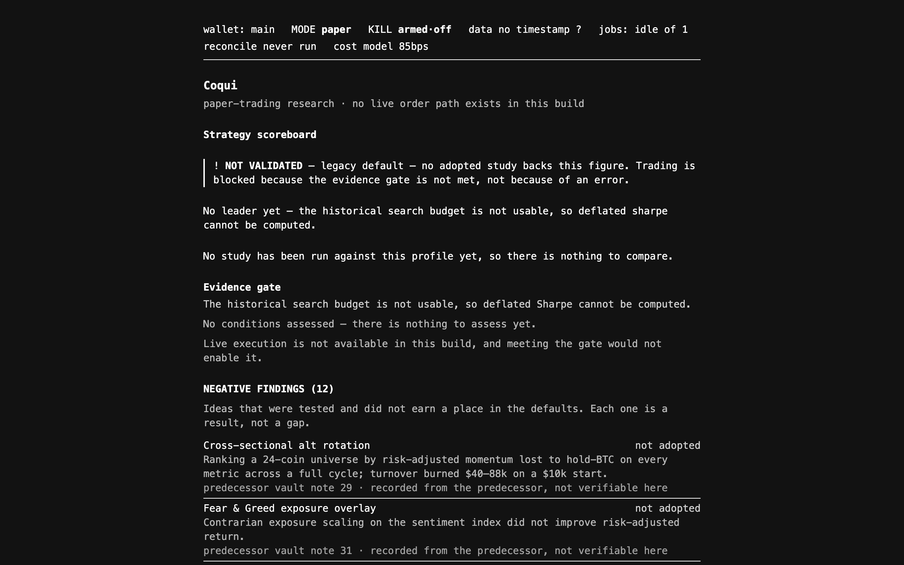

# Current interface inventory — 2026-08-23

**Baseline:** `p5-shell-and-ui` at `d25101f` before the additive workstation shell.

## Current shape

`App.tsx` renders every major surface into one narrow, vertically stacked document. There is no
route registry, sidebar, screen-level focus management, or active-profile provider. `StatusRail`,
`Portfolio`, `Alerts`, and `Settings` receive the literal profile id `main`; the remaining channels
implicitly use the one database opened by the composition root.

| Surface | Current owner | Renderer dependencies | Status |
|---|---|---|---|
| Status rail | `StatusRail.tsx` | `app.status-rail`, `market-data.prices` | Reusable, incomplete |
| Strategy scoreboard | `Scoreboard.tsx`, `TrackTable.tsx` | `risk.evidence-gate`, `research.scoreboard` | Reusable, incomplete |
| Negative findings | `NegativeFindings.tsx` | `research.negative-findings` | Reusable |
| Portfolio and paper comparison | `Portfolio.tsx`, `PaperComparison.tsx` | `portfolio.view`, `paper.portfolio` | Reusable, incomplete |
| Reconciliation | `Reconciliation.tsx`, `ResolveException.tsx` | `portfolio.reconciliation`, `portfolio.reconciliation.resolve` | Reusable |
| Allocation | `Allocation.tsx` | `portfolio.allocation` | Reusable, incomplete |
| Tax | `Tax.tsx` | `portfolio.tax` | Reusable, incomplete |
| Markets | `Markets.tsx` | `market-data.fear-greed`, `market-data.trending` | Reusable, incomplete |
| Risk | `Risk.tsx` | `risk.dashboard` | Reusable, incomplete |
| Alerts | `Alerts.tsx` | `alerts.view` | Reusable, incomplete |
| Settings | `Settings.tsx` | `accounts.settings` | Reusable, incomplete |
| Research-run list | inline in `App.tsx` | `research.runs` | Temporary |
| Deferred capabilities | `DeferredPanel.tsx` | none | Temporary documentation scaffold |

## Foundations to preserve

- The validated channel registry, `CoquiClient`, sandboxed preload, sender validation, CSP,
  permission denial, and external-navigation allowlist.
- TanStack Query ownership of every refresh cadence and the renderer-wide `setInterval` lint rule.
- The UI-kit action reducer, exact financial formatting, density scale, provenance/freshness/risk
  badges, and plain-language help.
- The immutable negative-result record and the visible `NOT VALIDATED` strategy state.
- Reconciliation exceptions as evidence requiring a decision, never invented or resized lots.
- The branded `ApprovedExecution`, paper OMS state machine, next-bar fill rule, exact-decimal ledger,
  recovery-to-`unknown`, and scheduler idempotency.

## Missing application-level ownership

- A route shell that displays one screen at a time while keeping global status visible.
- Production wiring for the already implemented profile manifest and prepared context switch.
- A single application service that owns proposal, evidence/risk review, approval, OMS persistence,
  and durable outcomes for both UI and scheduler callers.
- Paper performance evidence/read models and a bounded activity feed.
- A complete semantic theme and reusable chart/calendar primitives.

This inventory describes ownership and completeness; it does not authorize removal of working
behavior. Existing surfaces move into routes before they receive visual or interaction changes.
